# Models as a Service

This repository features an example of how you can set up 3scale and Red Hat SSO in front of models served by OpenShift AI to offer your users a portal through which they can register and get access keys to the models' endpoints.

Although not a reference architecture (there are many ways to implement this type of solution), this can serve as starting point to create such a service in your environment.

Further implementation could feature quotas, rate limits, different plans, billing,...

## Architecture Overview

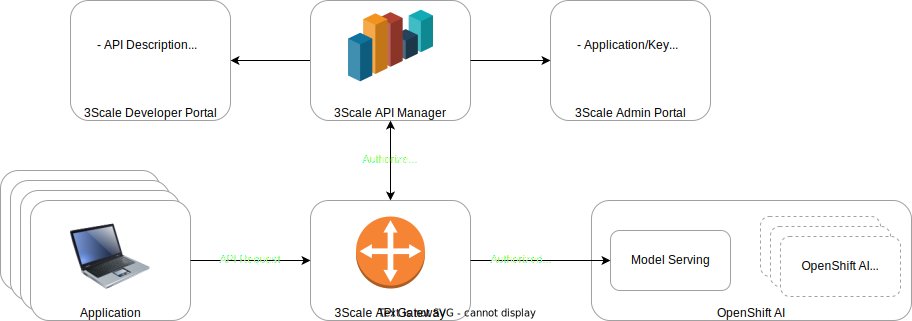

## Screenshots

Portal:

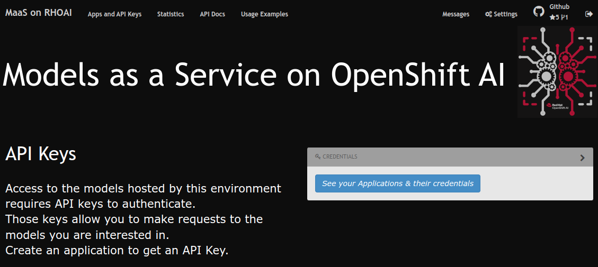

Services:

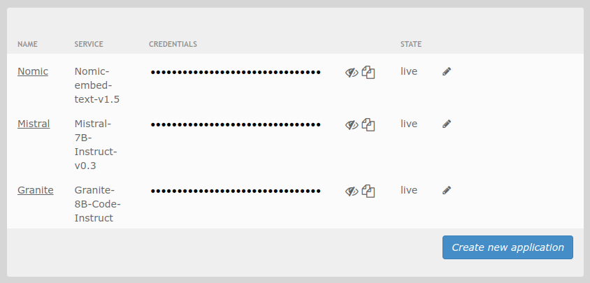

Service detail:

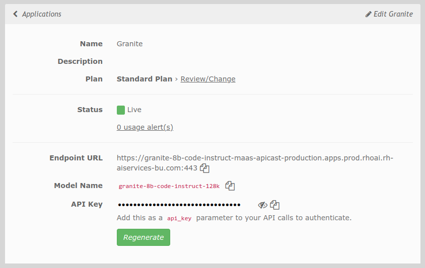

Statistics:

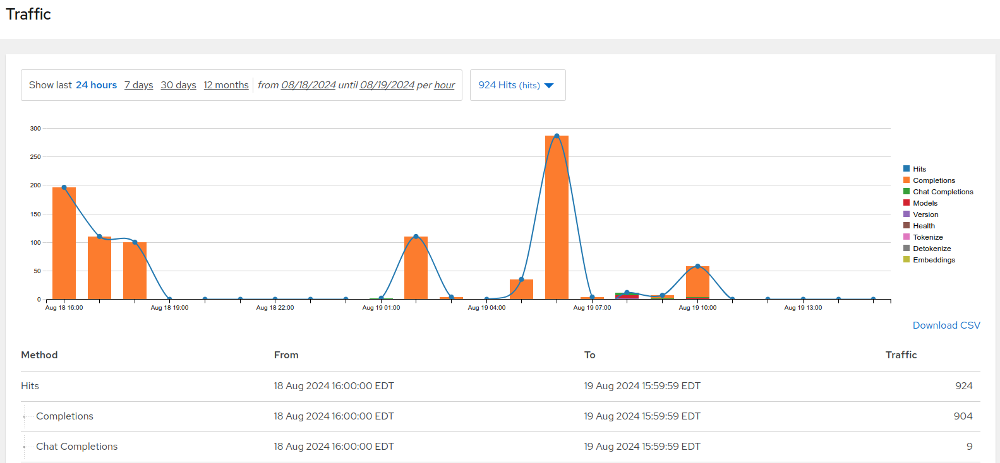

## Deployment

### Model Serving

The following is an example on how to copy and serve models using OpenShift AI. Adapt to the models you want to use.

- In OpenShift, create your projet, in this example `llm-hosting`.
- In the namespace YAML definition of the project, add the label `modelmesh-enabled: 'false'`
- In the project, create [an RGW Object Bucket Claim](./deployment/model_serving/obc-rgw.yaml). This will create the S3 storage space to store the models. Adapt to your own S3 storage if needed.
- Switch to OpenShift AI dashboard and create a Data Connection `models` with the information from the OBC.
    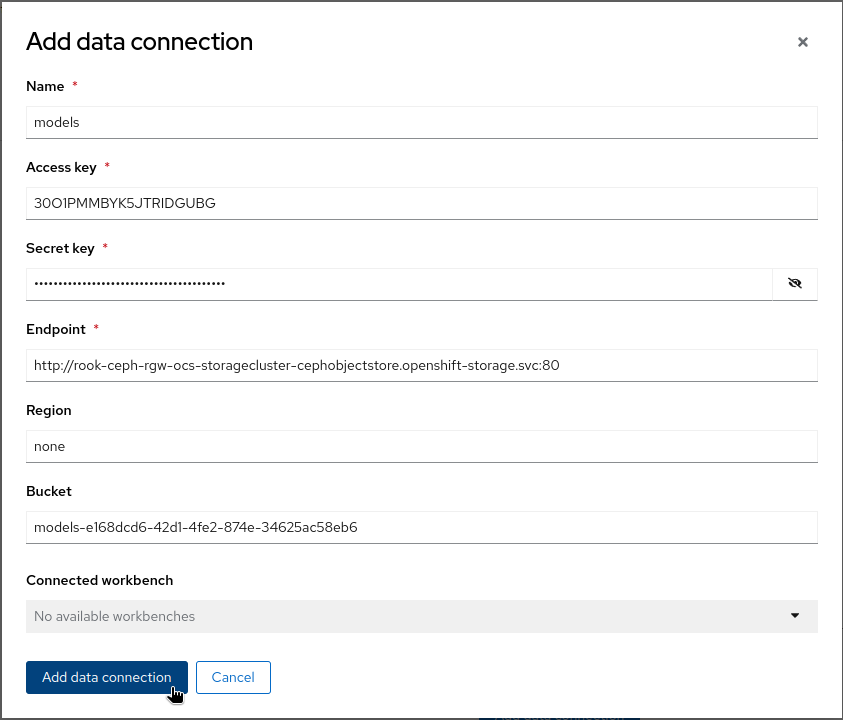
- In OpenShift AI, under any of your projects, create and launch an [ODH-TEC](https://github.com/opendatahub-io-contrib/odh-tec) workbench using the above data connection:

    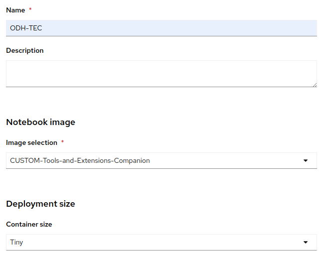

    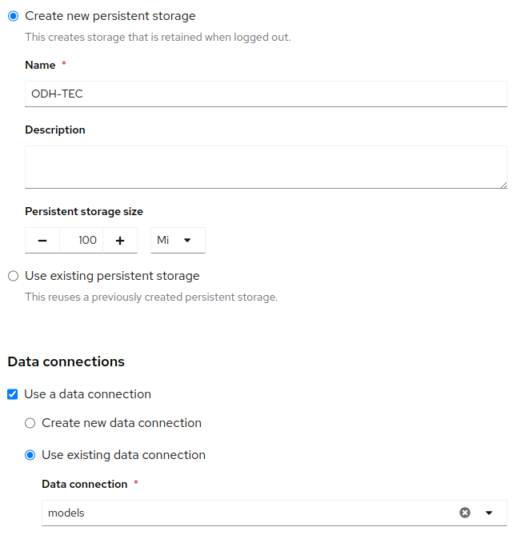
- Using ODH-TEC, import the following models from HuggingFace (don't forget to enter your HuggingFace Token in ODH-TEC Settings!):
  - [Granite-8B-Code-Instruct-128K](https://huggingface.co/ibm-granite/granite-8b-code-instruct-128k)
  - [Mistral-7B-Instruct-v0.3](https://huggingface.co/mistralai/Mistral-7B-Instruct-v0.3)
  - [Nomic-embed-text-v1.5](https://huggingface.co/nomic-ai/nomic-embed-text-v1.5)

    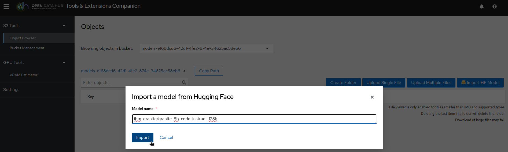

    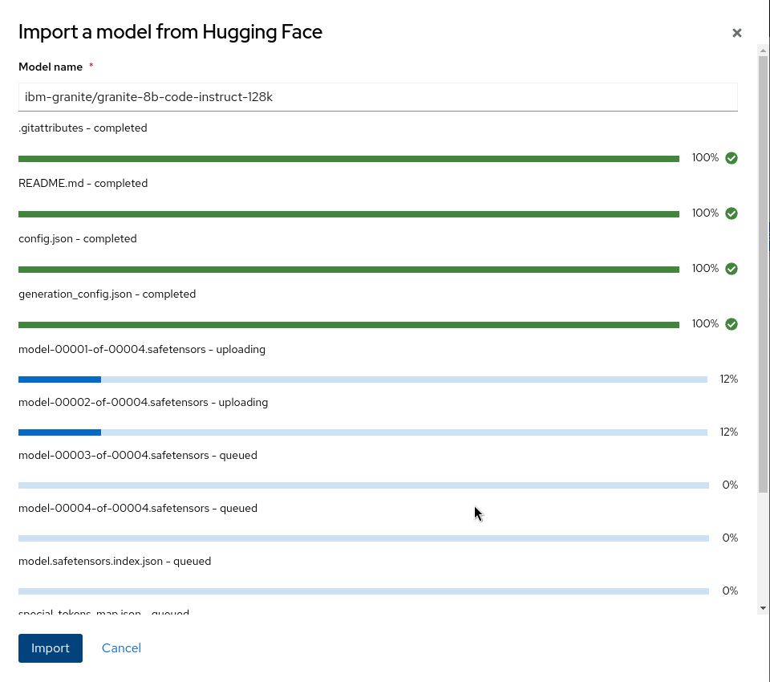
- From the OpenShift Console, deploy the different model servers using the following RuntimeConfigurations and InferenceServers:
  - [Granite-8B-Code-Instruct-128K](./deployment/model_serving/granite-code-vllm-raw.yaml)
  - [MisMistral-7B-Instruct-v0.3](./deployment/model_serving/mistral-vllm-raw.yaml)
  - [Nomic-embed-text-v1.5](./deployment/model_serving/nomic-embed-raw.yaml)

### Red Hat SSO

In this example we are using Red Hat SSO as the authentication backend for the 3scale Developer Portal. Other backends are supported if you prefer (Github and Auth0).

- Create the project `rh-sso`.
- Deploy the Red Hat Single Sign-On operator in the `rh-sso` namespace.
- Create a Keycloak instance using [keycloak.yaml](./deployment/rh-sso/keycloak.yaml).
- Create a `rhoai` KeycloakRealm using [keycloakrealm-maas.yaml](./deployment/rh-sso/keycloakrealm-maas.yaml).
- Open the Red Hat Single Sign-on console (route in the Routes section, access credentials in Secrets->`credentials-rh-sso`).
- Switch to the Rhoai realm:
  
  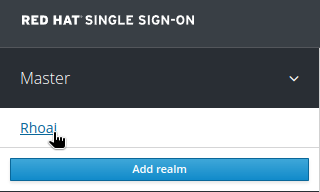
- In the Clients section, create a new client named `3scale`, of type `openid-connect`:

    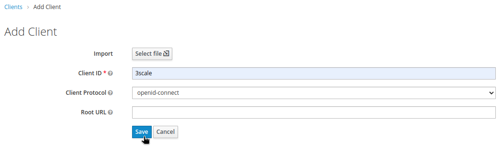
- Adjust the following:
  - Access Type: `confidential`
  - Enable only Standard Flow, leave all other toggle to off.
  - For the moment, set Valid Redirect URLs to `*`.

    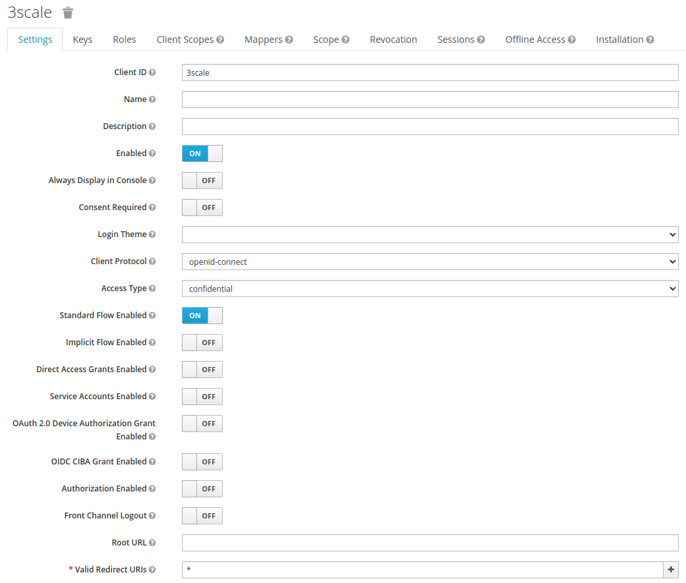
  - From the Credentials section, take note of the Secret.
  - In the Mappers sections, create two new mappers:
    - Click on `Add Builtin`, select `email verified` and click on `Add selected`. You will end up with this mapping configuration:

      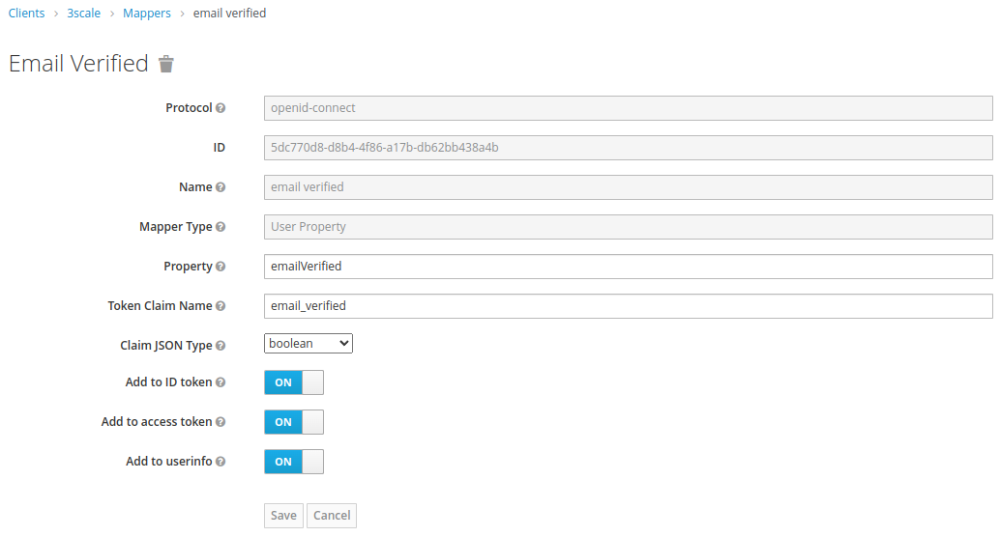
    - Click on `Create`, enter Name `org_name`, Mapper Type `User Attribute`, User Attribute `email`, Token Claim Name `org_name`, Claim JSON type `string`, first 3 switches to on.

      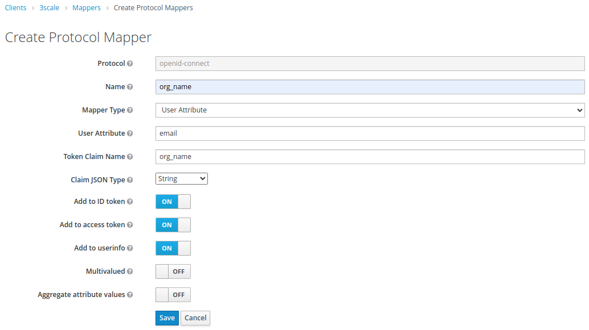
  - In this configuration, the organization name for a user will be the same as the user email. This is to achieve full separation of the accounts. Adjust to your likings.
- Create an IdentityProvider to connect your Realm to Red Hat authentication system. The important sections are `Trust Email` to enable, and set `Sync Mode` to import.

  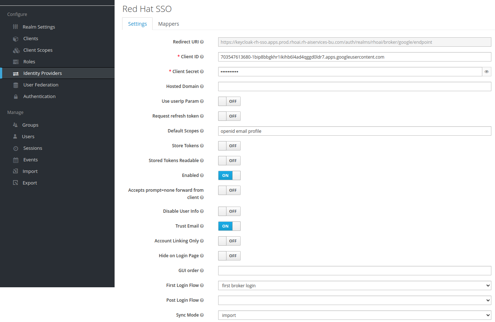

### 3Scale

#### Requirements

- OpenShift Data Foundation deployed to be able to create an RWX volume for 3Scale system storage.

#### 3Scale Deployment

We will start by creating the project and setting up the policy artifacts needed for tokens counting with LLMs.

- Create the project `3scale`.
- Open a Terminal and login to OpenShift.
- Switch to the folder [deployment/3scale/llm_metrics_policy](./deployment/3scale/llm_metrics_policy/) and run the following command:

    ```bash
    oc create secret generic llm-metrics \
        -n 3scale \
    --from-file=./apicast-policy.json \
    --from-file=./custom_metrics.lua \
    --from-file=./init.lua \
    --from-file=./llm.lua \
    --from-file=./portal_client.lua \
    --from-file=./response.lua \
    && oc label secret llm-metrics apimanager.apps.3scale.net/watched-by=apimanager
    ```

- Deploy the Red Hat Integration-3scale operator in the `3scale` namespace only!
- Using the deployed operator, create a Custom Policy Definition instance using [deployment/3scale/llm-metrics-policy.yaml](./deployment/3scale/llm-metrics-policy.yaml).
- Using the deployed operator, create an APIManager instance using [deployment/3scale/apimanager.yaml](./deployment/3scale/apimanager.yaml).
- Wait for all the Deployments (15) to finish.

#### Configuration

##### Base configuration

- Open the 3Scale administration portal for the RHOAI provider. It will be the Route starting with `https://maas-admin-apps...`.
- The credentials are stored in the Secret `system-seed` (`ADMIN_USER` and `ADMIN_PASSWORD`).
- You will be greeted by the Wizard that you can directly close:

  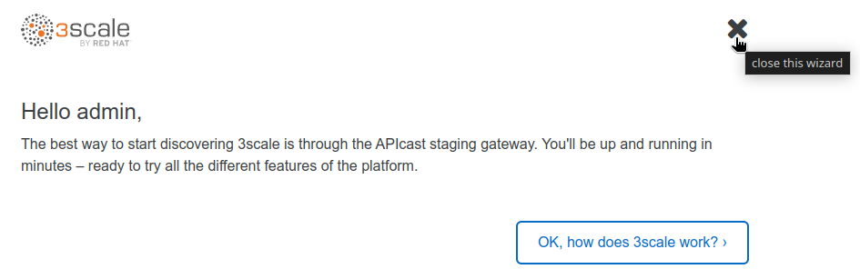.
- In the Account Settings sections (top menu):
  - In Overview, adjust the Account Details to your provider name and Timezone.

    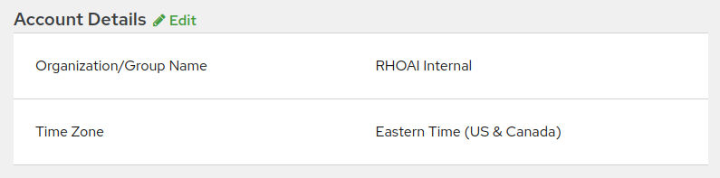
- Let's start by doing some cleanup:
  - In the `Products` section, click on the default `API` product:

    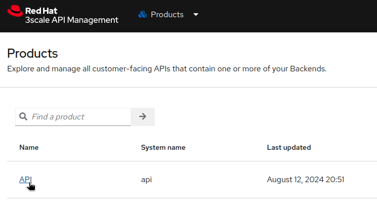
  - In the top right, click on `edit`:

    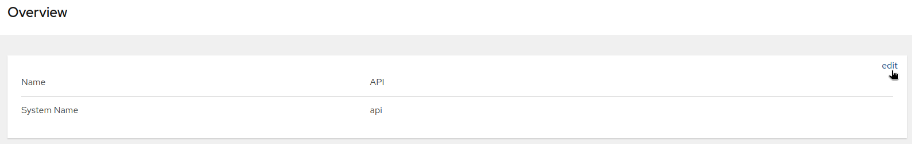
  - In the Backends section, delete the default `API Backend`:

    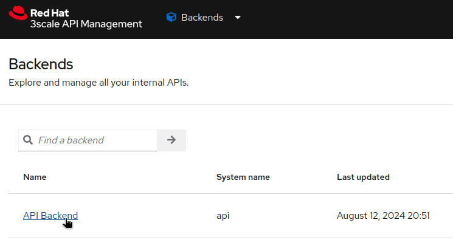

##### Backends and Products

- We will start by adding the different `Backends` to our models:
  - In the `Backends` section, create a new one for Granite. The `Private Base URL` is the one from the Service exposed by the model:

    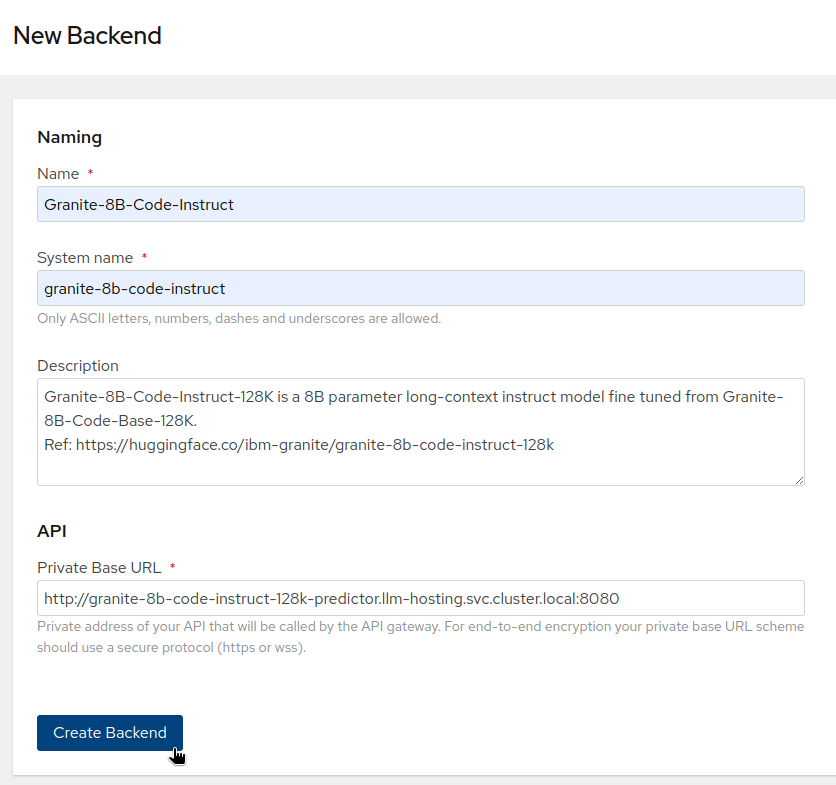
  - Do the same for the other models/endpoints.

    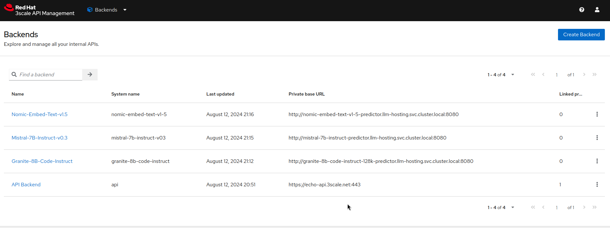
- We can now create the `Products`. There will be one for each Backend.

    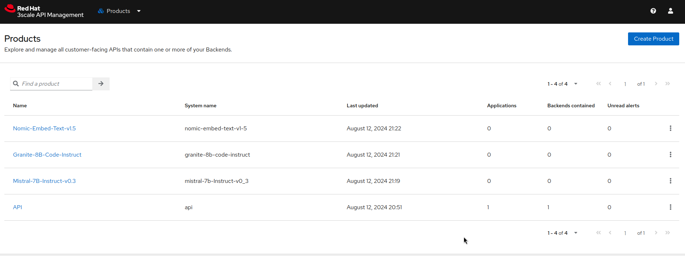
- For each product, apply the following configurations:
  - In `Integration->Settings`, change the `Auth user key` field content to `Authorization` and the `Credentials location` field to `As HTTP Basic Authentication` (click on `Update product` at the bottom to save):

    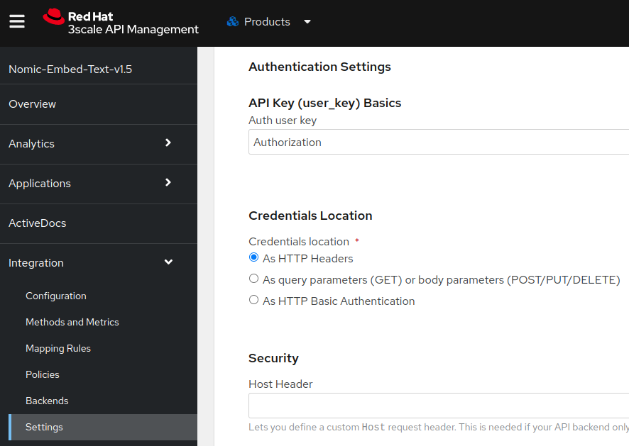
  - Link the corresponding Backend
  - Add the Policies in this order:
    1. CORS Request Handling:
       1. ALLOW_HEADERS: `Authorization`, `Content-type`, `Accept`.
       2. allow_origine: *
       3. allow_credentials: checked
    2. Optionally LLM Monitor for OpenAI-Compatible token usage. See [Readme](./deployment/3scale/llm_metrics_policy/README.md) for information and configuration.
    3. 3scale APIcast
  - Add the Methods and the corresponding Mapping Rules: create one pair for each API method/path.

    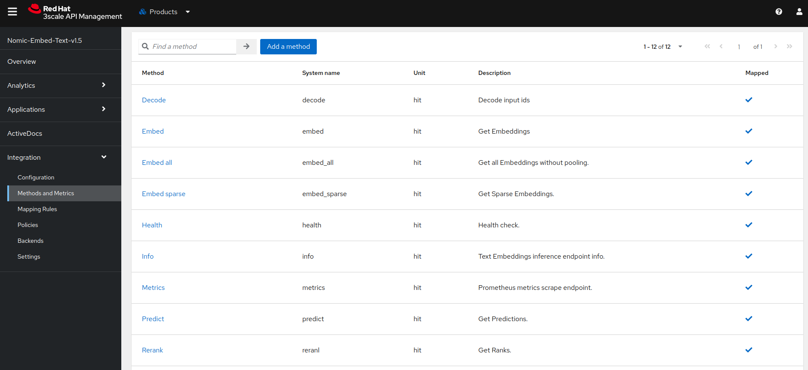
  - From the Integration->Configuration menu, promote the configuration to staging then production.
  - Along the way you can cleanup the unwanted default Products and Backends.

##### Plans

- For each Product, from the Applications->Application Plans menu, create a new Application Plan.

  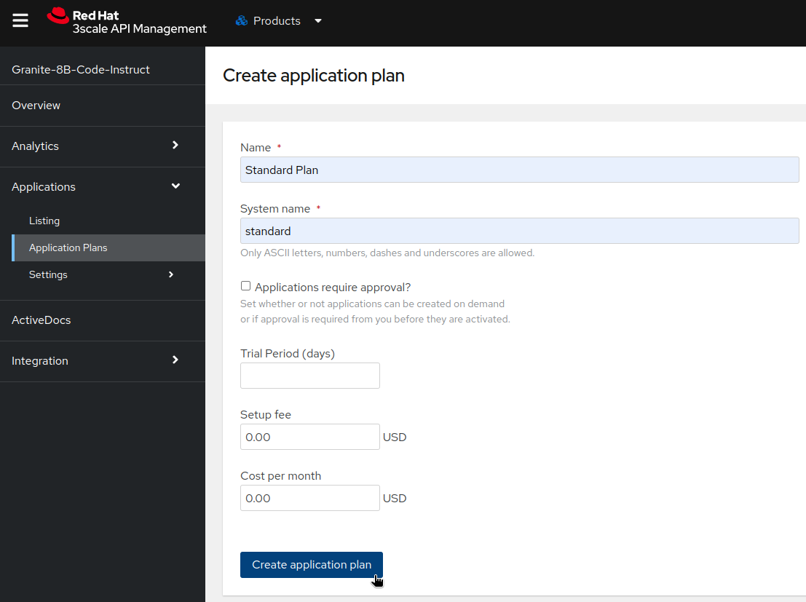  
- Once created, leave the Default plan to "No plan selected" so that users can choose their services for their applications, and publish it:

  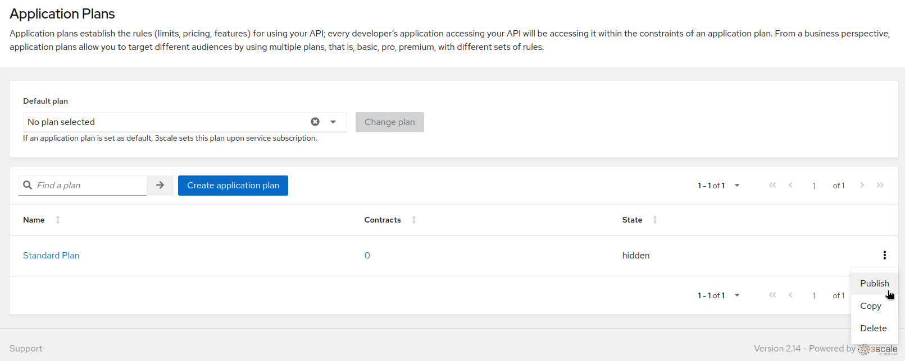
- In Applications->Settings->Usage Rules, set the Default Plan to `Default`. This will allow the users to see the different available Products.

  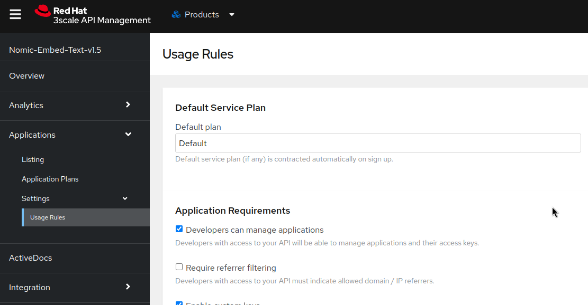

##### Portal configuration

- Switch to the Audience section from the top menu.
- In Developer Portal->Settings->Domains and Access, remove the Developer Portal Access Code.
- In Developer Portal->Settings->SSO Integrations, create a new SSO Integration: of type Red Hat Single Sign On.
  - Client: `3scale`
  - Client secret: ************
  - Realm: `https://keycloak-rh-sso.apps.prod.rhoai.rh-aiservices-bu.com/auth/realms/maas` (adjust to your cluster domain name).
  - `Published` ticked.
  - Once created, edit the RH-SSO to tick the checkbox `Always approve accounts...`

    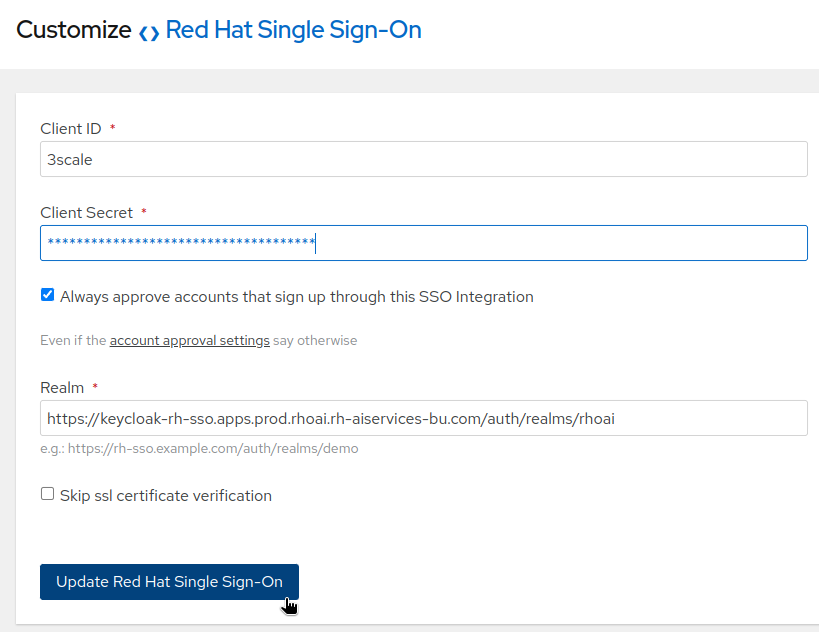
  - You can now test the authentication flow.

##### Portal content

Parasol AI Studio requires a Customized Developer Portal. Usually there are some resources like images, css and HTML snippets that should be uploaded for this pupose.

To automate the process, we are using the unofficial 3scale CMS CLI.

As the access to the 3scale Admin REST APIs is protected, we need to get an access-token as well as the host first
```bash
export ACCESS_TOKEN=`oc get secret system-seed -o json -n 3scale | jq -r '.data.ADMIN_ACCESS_TOKEN' | base64 -d`
export ADMIN_HOST=`oc get route -n 3scale | grep maas-admin | awk '{print $2}'`
```
For convenience we set an alias first and then launch the 3scale CMS tool
```bash
alias cms='podman run --userns=keep-id:uid=185 -it --rm -v ./deployment/3scale/portal:/cms:Z ghcr.io/fwmotion/3scale-cms:latest'
cms -k --access-token=${ACCESS_TOKEN} ${ACCESS_TOKEN} https://${ADMIN_HOST}/ upload -u
```

There is also a download option in case you want to do changes manually on the 3scale CMS.